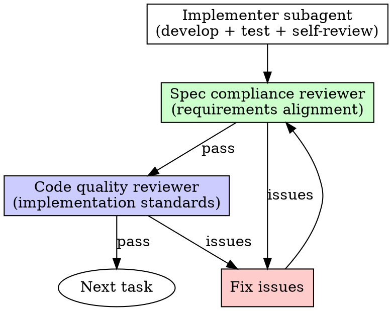

# Subagent-Driven Development

## Overview

Dispatch fresh subagents per task with two-stage reviews to avoid context pollution and maintain quality.

**Core principle:** Fresh context per task + mandatory reviews = high quality output.

## When to Use

- Implementation plan exists with mostly independent tasks
- Want to stay in current session
- Tasks can be executed by isolated agents

## The Process

### Step 1: Preparation

- Extract all tasks from plan into TodoWrite tracker
- Set up git worktree (using **using-git-worktrees** skill)
- Verify clean test baseline

### Step 2: Per-Task Cycle

For each task:

1. **Implementer subagent** handles development, testing, and self-review
2. **Spec compliance reviewer** validates requirements alignment
3. **Code quality reviewer** assesses implementation standards

### Step 3: Completion

Final reviewer confirms entire implementation before finishing.

## Critical Rules

- **Never skip** the two-stage review sequence
- **Never accept** unresolved reviewer feedback
- **Always provide** full task text upfront to subagents
- **Required:** Git worktree setup before starting

## Subagent Prompts

Include in every implementer prompt:
- Full task description (don't make them read the plan file)
- File paths and context
- TDD requirement
- Commit instruction after completion
