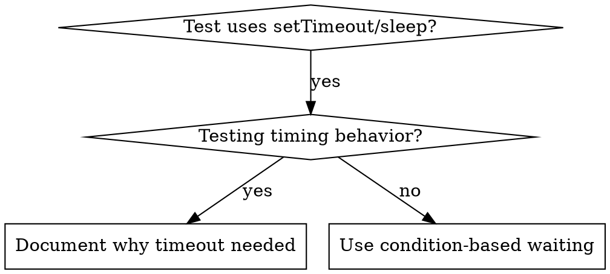

# Condition-Based Waiting

## Overview

Flaky tests often guess at timing with arbitrary delays. This creates race conditions where tests pass on fast machines but fail under load or in CI.

**Core principle:** Wait for the actual condition you care about, not a guess about how long it takes.

## When to Use



**Use when:**
- Tests have arbitrary delays (setTimeout, sleep, time.sleep())
- Tests are flaky (pass sometimes, fail under load)
- Tests timeout when run in parallel
- Waiting for async operations to complete

**Don't use when:**
- Testing actual timing behavior (debounce, throttle intervals)
- Always document WHY if using arbitrary timeout

## Core Pattern

**Before (arbitrary delay):**
```typescript
doSomething();
await new Promise(resolve => setTimeout(resolve, 50));
expect(result).toBe(expected);
```

**After (condition-based):**
```typescript
doSomething();
const result = await waitFor(() => getResult(), { timeout: 5000 });
expect(result).toBe(expected);
```

## Quick Patterns

**Wait for event:**
```typescript
await waitFor(() => events.some(e => e.type === 'ready'));
```

**Wait for state:**
```typescript
await waitFor(() => machine.state === 'ready');
```

**Wait for count:**
```typescript
await waitFor(() => items.length >= 3);
```

**Wait for file:**
```typescript
await waitFor(() => fs.existsSync(filePath));
```

**Complex condition:**
```typescript
await waitFor(() => obj.loaded && obj.items.length > 0 && obj.error === null);
```

## Implementation

```typescript
async function waitFor<T>(
  condition: () => T | Promise<T>,
  options: { timeout?: number; interval?: number; message?: string } = {}
): Promise<T> {
  const { timeout = 5000, interval = 10, message = 'Condition not met' } = options;
  const start = Date.now();

  while (Date.now() - start < timeout) {
    const result = await condition();
    if (result) return result;
    await new Promise(resolve => setTimeout(resolve, interval));
  }

  throw new Error(`${message} (waited ${timeout}ms)`);
}
```

## Common Mistakes

**Polling too frequently (wastes CPU):**
```typescript
// Bad: 1ms polling
await waitFor(check, { interval: 1 });
// Good: 10ms polling
await waitFor(check, { interval: 10 });
```

**No timeout (infinite loop):**
```typescript
// Bad: no timeout
while (!condition()) { await sleep(10); }
// Good: timeout protection
await waitFor(condition, { timeout: 5000 });
```

**Stale data (cached values):**
```typescript
// Bad: reads value once
const val = getValue();
await waitFor(() => val === expected);
// Good: re-reads each check
await waitFor(() => getValue() === expected);
```

## When Arbitrary Timeout IS Correct

```typescript
// Tool ticks every 100ms - need 2 ticks to verify partial output
await triggerCondition();
// Intentional: waiting for 2 tick cycles (100ms each)
// to verify partial output behavior
await new Promise(resolve => setTimeout(resolve, 250));
expect(output).toContain('partial');
```

Document WHY the specific duration matters.

## Real-World Impact

From debugging session (2025-10-03):
- Fixed 15 flaky tests across 3 files
- Pass rate: 60% → 100%
- Execution time: 40% faster (no unnecessary waits)
- Zero flaky failures in subsequent runs
