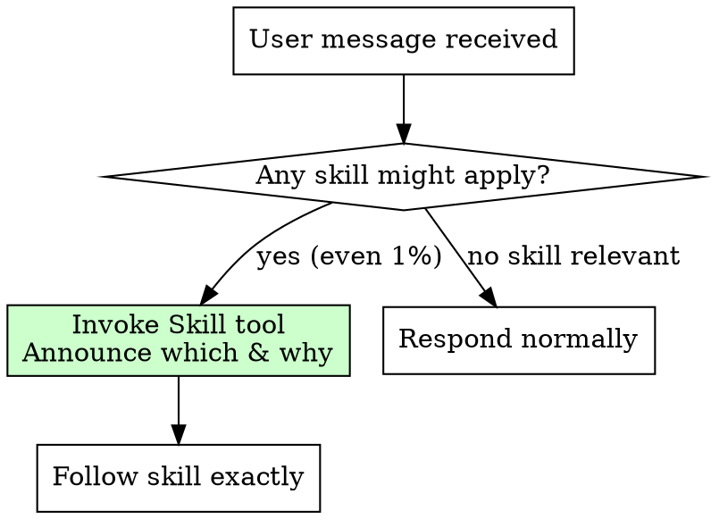

# Using Superpowers

## Overview

**Always invoke relevant skills BEFORE any response or action.** This is not negotiable. This is not optional.

**Core principle:** If there's even a 1% chance a skill applies, invoke it first.

## Decision Flow

## Red Flags (Rationalization Patterns)

If you're thinking any of these, STOP and invoke the skill:

- "This is just a simple question"
- "I need more context first"
- "I can check files quickly"
- "The skill doesn't exactly match"
- "I'll use the skill after this step"

All of these are false reasoning that should trigger skill invocation instead.

## Skill Priority

When multiple skills apply:
1. **Process skills first** (brainstorming, debugging) determine *approach*
2. **Implementation skills second** guide *execution*

## Skill Types

**Rigid skills** (like TDD) require exact adherence.
**Flexible skills** (like patterns) allow contextual adaptation.
The skill itself indicates which applies.
